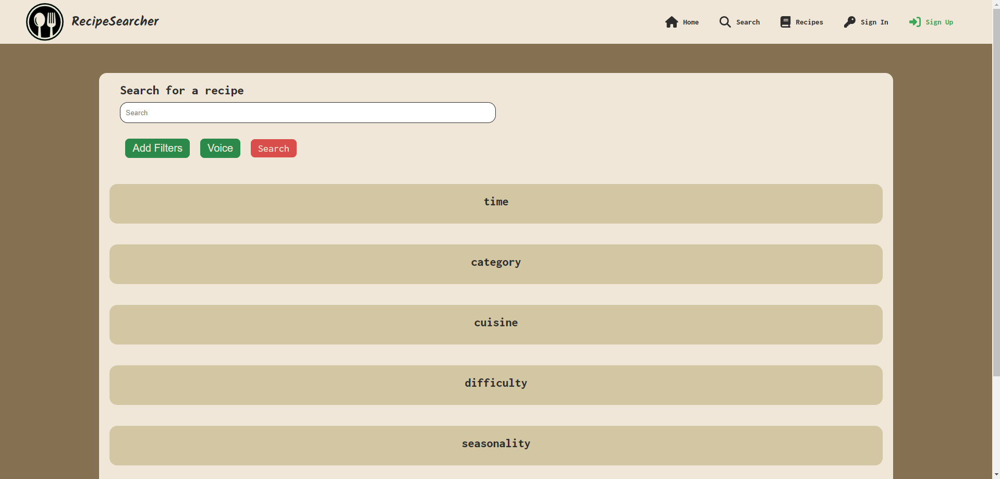
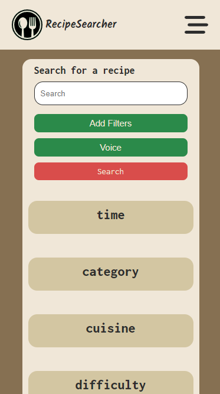
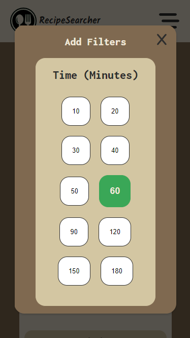
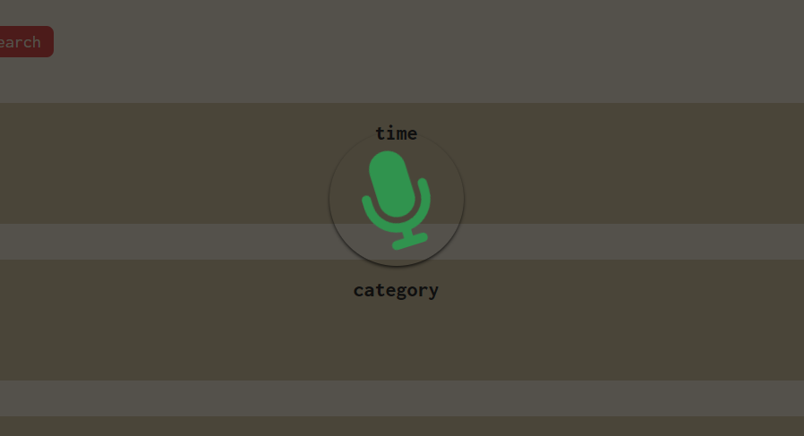
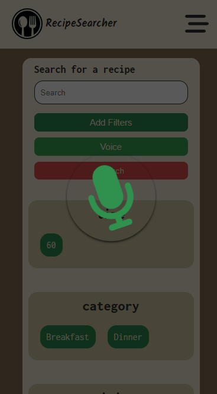
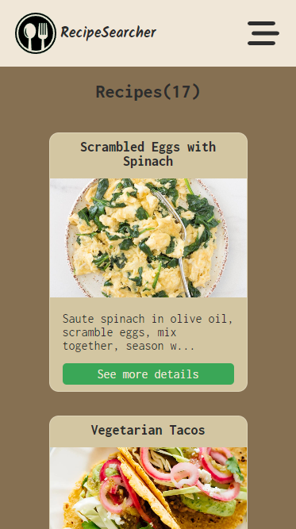
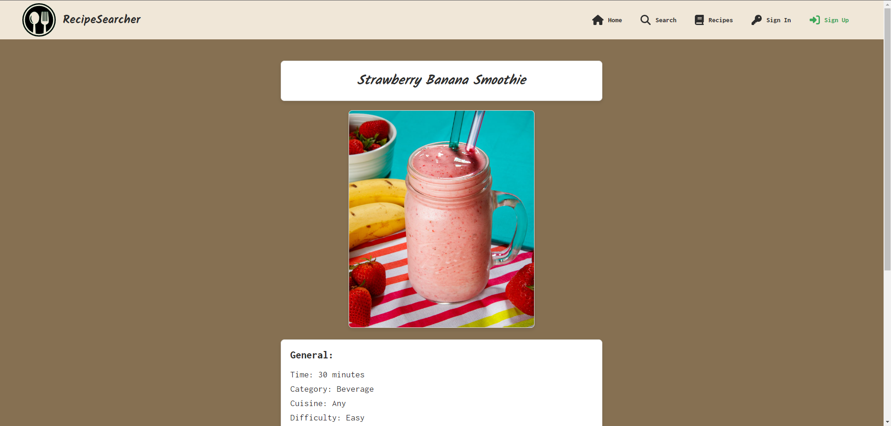
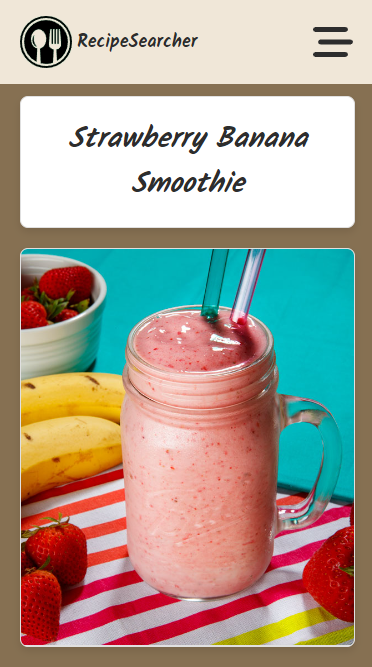
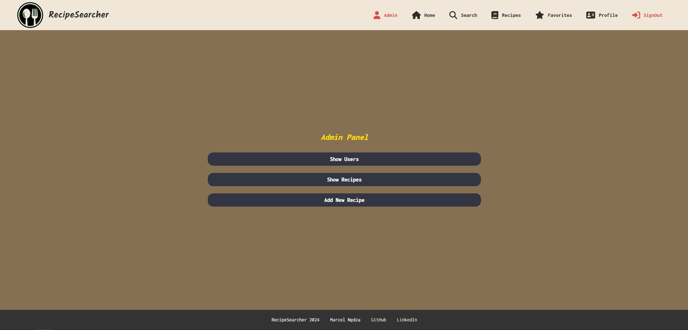

# Recipe Searcher Frontend

This is the frontend part of the Recipe Searcher web application.

## Technologies Used

The frontend of Recipe Searcher is built using the following technologies:

- **React.js**: A JavaScript library for building user interfaces.
- **React Context**: A predictable state container for managing application state.
- **React Router**: A routing library for React applications.
- **CSS**: Styling is done using CSS for custom styles and Semantic UI React for component styling.

## Search view

Main search desktop view

Main search mobile view

Add filters panel desktop view

Add filters panel mobile view

Voice animation desktop view

Voice animation mobile view

## Recipes view

Recipes desktop view

Recipes mobile view

Recipe detail desktop view

Recipe detail mobile view

Panel admin desktop view

Panel admin mobile view

